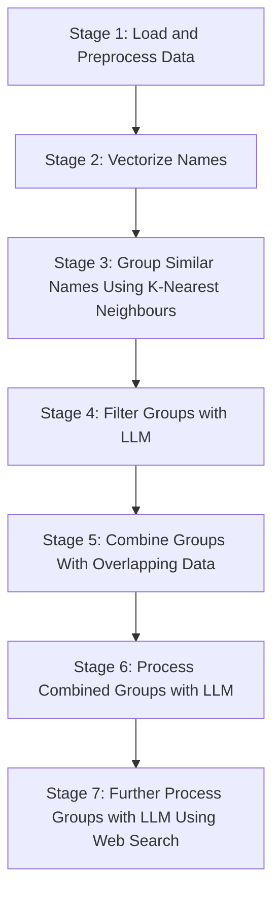

Usage Instructions:

You can run the script and specify the stage you want to start from using the --stage argument. For stages beyond 1, you need to provide the required input files using the --input argument.

For example:

To start from Stage 1:

bash
Copy code
python main.py --stage 1 --output-dir outputs --search-method google
To start from Stage 2, using the output from Stage 1 (preprocessed_data.pkl):

bash
Copy code
python main.py --stage 2 --input preprocessed_data.pkl
To start from Stage 3, using the outputs from Stage 2:

bash
Copy code
python main.py --stage 3 --input vectorizer.pkl name_vectors.pkl unique_combined_names.pkl --output-dir outputs
To start from Stage 4, using the output from Stage 3 (grouped_names.json):

bash
Copy code
python script.py --stage 4 --input grouped_names.json
To start from Stage 5, using the output from Stage 4 (refined_groups.json):

bash
Copy code
python main.py --stage 5 --input refined_groups.json --output-dir outputs
To start from Stage 6, using the output from Stage 5 (merged_groups.pkl):

bash
Copy code
python script.py --stage 6 --input merged_groups.pkl
To start from Stage 7, using the outputs from Stage 6 (unsure_groups.json and final_groups.json):

bash
Copy code
python main.py --stage 7 --input final_groups.json unsure_groups.json --output-dir outputs --search-method duckduckgo
Notes:

Each stage saves its outputs to files, which are then used as inputs for the subsequent stages.
The script uses the LLM (language model) in stages where necessary. Ensure that the model is properly initialized and accessible.
The thresholds and parameters can be adjusted as needed using the command-line arguments or by modifying the script.
Important:

Ensure that all required dependencies are installed and properly configured.
Adjust file paths and configurations according to your environment.
Be cautious with web searches in Stage 7 to avoid being blocked by search engines due to too many requests.